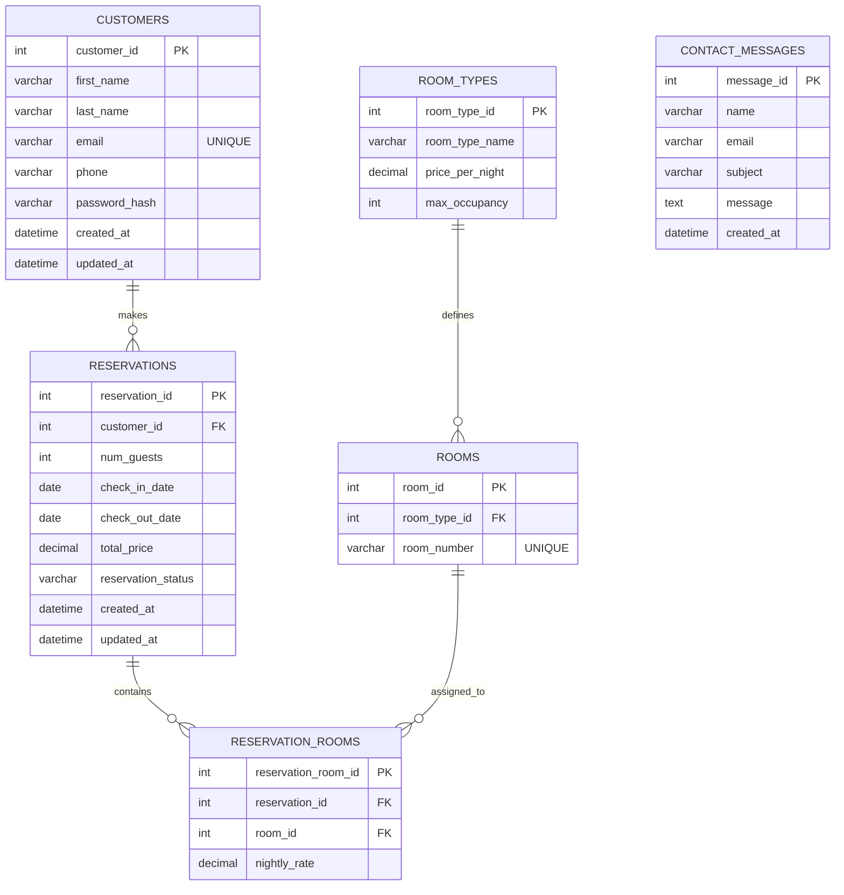

# ERD

## Customers Table

| Column               | Type          | Constraints / Notes                          |
|----------------------|---------------|----------------------------------------------|
| customer_id          | INT           | PK, auto-increment                           |
| first_name           | VARCHAR(100)  | Required                                     |
| last_name            | VARCHAR(100)  | Required                                     |
| email                | VARCHAR(255)  | UNIQUE, required                             |
| phone                | VARCHAR(20)   | Optional                                     |
| password_hash        | VARCHAR(255)  | Required, hashed password                    |
| created_at           | DATETIME      | Default: current timestamp                   |
| updated_at           | DATETIME      | Default: current timestamp on update         |

## Reservations Table

| Column                   | Type          | Constraints / Notes                          |
|--------------------------|---------------|----------------------------------------------|
| reservation_id           | INT           | PK, auto-increment                           |
| customer_id              | INT           | FK → Customers.customer_id, required         |
| num_guests               | INT           | Required                                     |
| check_in_date            | DATE          | Required                                     |
| check_out_date           | DATE          | Required                                     |
| total_price              | DECIMAL(10,2) | Required                                     |
| reservation_status       | VARCHAR(20)   | Required                                     |
| created_at               | DATETIME      | Default: current timestamp                   |
| updated_at               | DATETIME      | Default: current timestamp on update         |

## ReservationRooms Table

| Column              | Type          | Constraints / Notes                          |
|---------------------|---------------|----------------------------------------------|
| reservation_room_id | INT           | PK, auto-increment                           |
| reservation_id      | INT           | FK → Reservations.reservation_id, required   |
| room_id             | INT           | FK → Rooms.room_id, required                 |
| nightly_rate        | DECIMAL(10,2) | Required                                     |

## Rooms Table

| Column         | Type         | Constraints / Notes                          |
|----------------|--------------|----------------------------------------------|
| room_id        | INT          | PK, auto-increment                           |
| room_type_id   | INT          | FK → Room_Types.room_type_id, required       |
| room_number    | VARCHAR(20)  | UNIQUE, required                             |

## RoomTypes Table

| Column           | Type          | Constraints / Notes                          |
|------------------|---------------|----------------------------------------------|
| room_type_id     | INT           | PK, auto-increment                           |
| room_type_name   | VARCHAR(50)   | Required                                     |
| price_per_night  | DECIMAL(10,2) | Required                                     |
| max_occupancy    | INT           | Required                                     |

## ContactMessages Table

| Column                   | Type          | Constraints / Notes                          |
|--------------------------|---------------|----------------------------------------------|
| message_id               | INT           | PK, auto-increment                           |
| name                     | VARCHAR(100)  | Required                                     |
| email                    | VARCHAR(100)  | Required                                     |
| subject                  | VARCHAR(100)  | Required                                     |
| message                  | Text          | Required                                     |
| created_at               | DATETIME      | Default: current timestamp                   |
