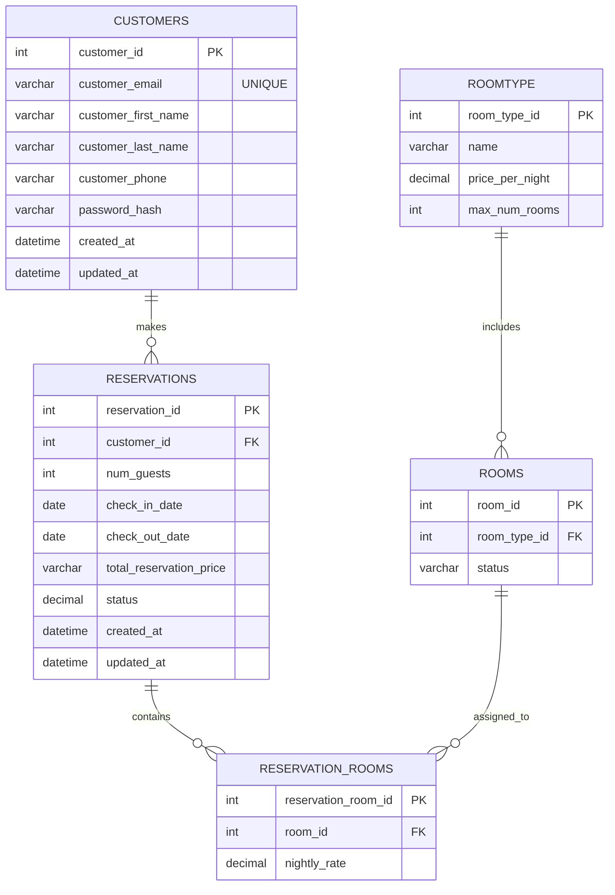

# ERD

## Customers Table

| Column               | Type          | Constraints / Notes                          |
|----------------------|---------------|----------------------------------------------|
| customer_id          | INT           | PK, auto-increment                           |
| customer_email       | VARCHAR(255)  | UNIQUE, required                             |
| customer_first_name  | VARCHAR(100)  | Required                                     |
| customer_last_name   | VARCHAR(100)  | Required                                     |
| customer_phone       | VARCHAR(20)   | Optional                                     |
| password_hash        | VARCHAR(255)  | Required, hashed password                    |
| created_at           | DATETIME      | Default: current timestamp                   |
| updated_at           | DATETIME      | Default: current timestamp on update         |

## Reservations Table

| Column                   | Type          | Constraints / Notes                          |
|--------------------------|---------------|----------------------------------------------|
| reservation_id           | INT           | PK, auto-increment                           |
| customer_id              | INT           | FK → Customers.customer_id, required         |
| num_guests               | INT           | Required                                     |
| check_in_date            | DATE          | Required                                     |
| check_out_date           | DATE          | Required                                     |
| total_reservation_price  | DECIMAL(10,2) | Required                                     |
| status                   | VARCHAR(20)   | Required                                     |
| created_at               | DATETIME      | Default: current timestamp                   |
| updated_at               | DATETIME      | Default: current timestamp on update         |

## ReservationRooms Table

| Column              | Type          | Constraints / Notes                          |
|---------------------|---------------|----------------------------------------------|
| reservation_room_id | INT           | PK, auto-increment                           |
| room_id             | INT           | FK → Rooms.room_id, required                 |
| nightly_rate        | DECIMAL(10,2) | Required                                     |

## Rooms Table

| Column        | Type        | Constraints / Notes                          |
|---------------|-------------|----------------------------------------------|
| room_id       | INT         | PK, auto-increment                           |
| room_type_id  | INT         | FK → RoomType.room_type_id, required         |
| status        | VARCHAR(10) | Required                                     |

## RoomType Table

| Column          | Type          | Constraints / Notes                          |
|-----------------|---------------|----------------------------------------------|
| room_type_id    | INT           | PK, auto-increment                           |
| name            | VARCHAR(50)   | Required                                     |
| price_per_night | DECIMAL(10,2) | Required                                     |
| max_num_rooms   | INT           | Required                                     |